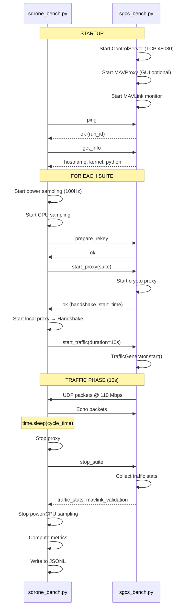

# Benchmark Execution Model

> Phase 0.5 • Generated: 2026-01-18
> Status: VERIFIED FROM CODE

---

## End-to-End Flow



---

## Timing Model

| Phase | Duration | Trigger |
|-------|----------|---------|
| Handshake | Variable (~1-5s) | Proxy start |
| Traffic | Fixed (10s default) | CLI `--cycle-time` |
| Inter-suite | 2s | Hardcoded delay |
| Total per suite | ~15-17s | Computed |

---

## Data Flow

```
┌─────────────────────────────────────────────────────────────┐
│                         DRONE                                │
├─────────────────────────────────────────────────────────────┤
│  DroneBenchmarkController                                    │
│  ├── DronePowerMonitor → INA219 (100Hz)                      │
│  ├── SystemMetricsCollector → psutil (0.5Hz)                 │
│  ├── MavLinkMetricsCollector → pymavlink                     │
│  ├── UdpEchoServer → latency extraction                      │
│  └── DroneProxyManager → core.run_proxy                      │
│                                                              │
│  Output: logs/benchmarks/{run_id}/benchmark_{run_id}.jsonl   │
└──────────────────────────┬──────────────────────────────────┘
                           │
                           │ TCP:48080 (control)
                           │ UDP:46011/46012 (encrypted)
                           ▼
┌─────────────────────────────────────────────────────────────┐
│                          GCS                                 │
├─────────────────────────────────────────────────────────────┤
│  GcsBenchmarkServer                                          │
│  ├── GcsProxyManager → core.run_proxy                        │
│  ├── TrafficGenerator → UDP blast + timestamp                │
│  ├── GcsMavProxyManager → MAVProxy (optional GUI)            │
│  └── GcsMavLinkCollector → validation only                   │
│                                                              │
│  Returns: JSON via TCP control channel                       │
└─────────────────────────────────────────────────────────────┘
```

---

## Policy Engine

| Property | Value |
|----------|-------|
| Policy Name | `deterministic_rotation` |
| Suite Order | Alphabetical by suite ID |
| Cycle Time | 10s (default) |
| Rekey | None (single suite per cycle) |
| Termination | All suites complete or `--max-suites` reached |

---

## Command Protocol

| Command | Direction | Purpose |
|---------|-----------|---------|
| `ping` | Drone → GCS | Readiness check |
| `get_info` | Drone → GCS | Collect GCS environment |
| `prepare_rekey` | Drone → GCS | Stop previous proxy |
| `start_proxy` | Drone → GCS | Start proxy for suite |
| `start_traffic` | Drone → GCS | Begin traffic generation |
| `stop_suite` | Drone → GCS | Stop and collect metrics |
| `shutdown` | Drone → GCS | Graceful termination |
