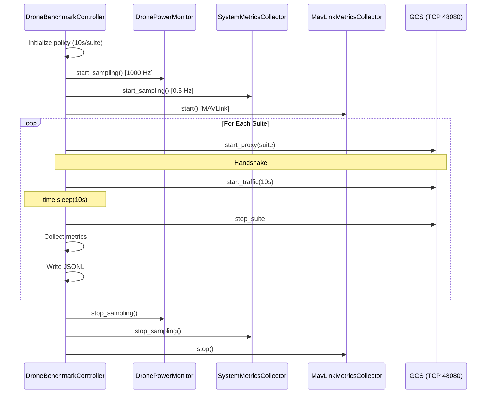

# Control & Data Flow Map

> Phase 0.9 • Generated: 2026-01-19
> Status: DOCUMENTED

---

## Entry Point Difference

| File | Role | Power | Metrics |
|------|------|-------|---------|
| `sdrone_mav.py` | Operational MAV | ❌ | ❌ |
| `sdrone_bench.py` | Benchmark suite | ✅ 1000Hz | ✅ Full |

---

## Execution Flow: `sdrone_bench.py`

---

## Timing Model

| Phase | Duration | Mechanism |
|-------|----------|-----------|
| Per-suite | 10s | `time.sleep(cycle_time)` |
| Handshake | Variable | Proxy startup |
| Traffic | 10s | TrafficGenerator |
| Inter-suite | ~2s | Stop + Start |

---

## Data Generation Points

| Data | Source | Timestamp |
|------|--------|-----------|
| Power samples | INA219 @ 1000Hz | `time.time_ns()` |
| CPU samples | psutil @ 0.5Hz | Python wall clock |
| MAVLink msgs | pymavlink | MAVLink timestamp |
| Latency | UDP embedded `ts_ns` | Sender clock |
| Handshake | Proxy status file | JSON field |

---

## Logging Destinations

| Data | Format | Path |
|------|--------|------|
| Metrics | JSONL | `logs/benchmarks/{run_id}/benchmark_{run_id}.jsonl` |
| Power CSV | CSV | `logs/benchmarks/{run_id}/power_*.csv` |
| MAVProxy | Log | `logs/benchmarks/{run_id}/mavproxy_*.log` |
| Handshake | Status | `secrets/matrix/status.json` |
