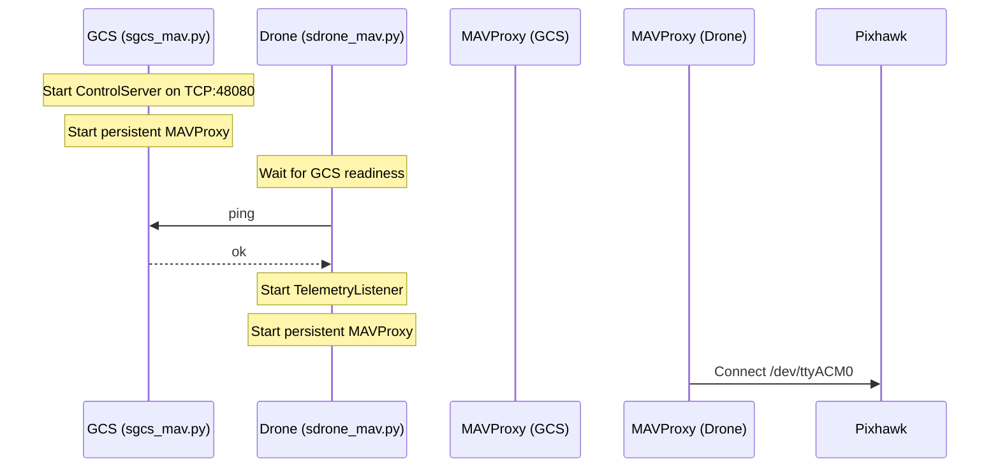
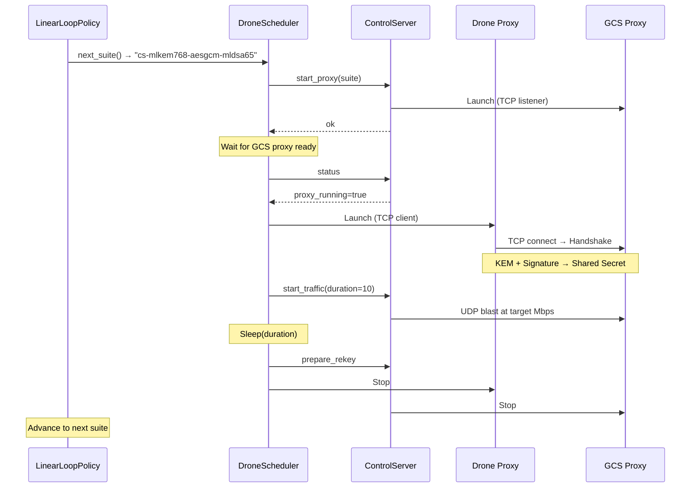

# Execution Mental Model

> Generated: 2026-01-18T23:24
> Status: VERIFIED

---

## System Startup Sequence



---

## Suite Execution Flow



---

## Handshake Protocol Detail

### Phase 1: ServerHello (GCS → Drone)

```
┌─────────────────────────────────────────┐
│ version (1B) │ kem_name │ sig_name │   │
│ session_id (8B) │ kem_pub │ signature │
│ challenge (32B)                          │
└─────────────────────────────────────────┘
```

- GCS generates ephemeral KEM keypair
- GCS signs (session_id || kem_pub || challenge) with long-term sig key

### Phase 2: ClientReply (Drone → GCS)

```
┌─────────────────────────────────────────┐
│ kem_ciphertext │ response_hmac          │
└─────────────────────────────────────────┘
```

- Drone encapsulates shared secret using GCS kem_pub
- Drone computes HMAC over challenge

### Phase 3: Key Derivation

```python
transport_keys = HKDF(
    shared_secret,
    info = session_id || kem_name || sig_name,
    salt = None,
    dkm_len = 64  # 32 bytes each direction
)
key_gcs_to_drone = transport_keys[0:32]
key_drone_to_gcs = transport_keys[32:64]
```

---

## AEAD Packet Format

```
┌────────────────────────────────────────────────────┐
│ Header (22 bytes)                                   │
├────────────────────────────────────────────────────┤
│ version (1B) │ kem_id (1B) │ kem_param (1B)        │
│ sig_id (1B) │ sig_param (1B) │ session_id (8B)     │
│ sequence (8B) │ epoch (1B)                         │
├────────────────────────────────────────────────────┤
│ Ciphertext + Tag (variable)                        │
└────────────────────────────────────────────────────┘
```

- Header used as AAD (authenticated but not encrypted)
- IV derived: `epoch (1B) || sequence (11B)` (not transmitted)
- Replay window: sliding 1024-packet bitmap

---

## Data Flow Diagram

```
┌────────────────┐     ┌─────────────────┐     ┌────────────────┐
│    MAVLink     │     │   Crypto Proxy  │     │    Network     │
│  (Plaintext)   │────►│   (async_proxy) │────►│  (Encrypted)   │
│ UDP:47003/4    │     │   AEAD enc/dec  │     │  UDP:46011/12  │
└────────────────┘     └─────────────────┘     └────────────────┘
         │                      │                      │
         ▼                      ▼                      ▼
    Application            core/aead.py         Wire Protocol
```

---

## Power Monitoring Pipeline

```
INA219 (I2C@0x40)
       │
       ▼
Ina219PowerMonitor.iter_samples()
       │ ← PowerSample(timestamp_ns, current_a, voltage_v, power_w)
       ▼
CSV Writer (logs/power_*.csv)
       │
       ▼
PowerSummary (aggregated per capture window)
```

---

## Policy Engine

| Policy Class | Behavior |
|--------------|----------|
| `LinearLoopPolicy` | Sequential suite iteration |
| `RandomPolicy` | Random suite selection |
| `ManualOverridePolicy` | External control |

---

## Critical File Dependencies

```
sdrone_mav.py
├── core.config → CONFIG dict
├── core.suites → get_suite(), list_suites()
├── core.process → ManagedProcess
├── tools.mavproxy_manager → MavProxyManager
└── sscheduler.policy → LinearLoopPolicy

core.run_proxy
├── core.handshake → client_drone_handshake()
├── core.async_proxy → DatagramProxy
└── core.aead → Sender, Receiver
```
