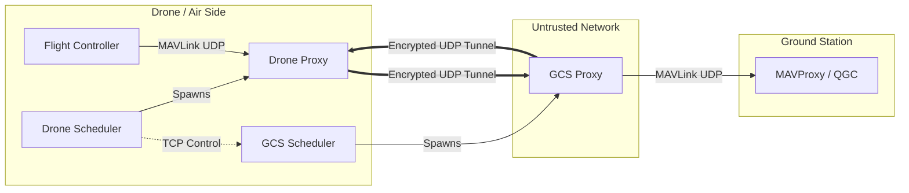

# COMPLETE FORENSIC ANALYSIS: `secure-tunnel`

## 1. Executive Summary
The `secure-tunnel` project is a specialized **Hybrid Post-Quantum Cryptography (PQC) VPN** designed for securing Unmanned Aerial Vehicle (UAV) command and control (C2) links. It encapsulates standard MAVLink UDP traffic inside an authenticated, encrypted tunnel using NIST-standardized PQC algorithms (ML-KEM/Kyber, ML-DSA/Dilithium) alongside classical AEAD ciphers (AES-GCM, ChaCha20).

The system is architected as a **transparent UDP proxy** with a split-process design: a high-performance forwarding plane (`core.async_proxy`) and a Python-based orchestration layer (`sscheduler`) that manages cryptographic agility and rekeying.

## 2. System Architecture

### 2.1. High-Level Topology
The system operates in a **Drone-GCS (Ground Control Station)** pair.
*   **Drone (Controller)**: Initiates connections, dictates cryptographic policy, and drives the rekeying schedule.
*   **GCS (Follower)**: Listens for control commands and mirrors the drone's cryptographic state.

### 2.2. Component Inventory
| Component | Path | Role |
| :--- | :--- | :--- |
| **Core Proxy** | `core/async_proxy.py` | The data plane engine. Uses `selectors` for deterministic I/O (non-asyncio). Handles packet encryption/decryption. |
| **Handshake** | `core/handshake.py` | Implements the custom TCP-based authenticated key exchange using `liboqs`. |
| **Crypto Registry** | `core/suites.py` | Maps suite names (e.g., `cs-mlkem768-aesgcm-mldsa65`) to OQS algorithm IDs. |
| **Drone Scheduler** | `sscheduler/sdrone.py` | **Controller**. Iterates through crypto suites, commands GCS, and manages the drone proxy. |
| **GCS Scheduler** | `sscheduler/sgcs.py` | **Follower**. Runs a TCP control server (`48080`) to receive commands from the drone. |
| **Power Monitor** | `core/power_monitor.py` | Hardware abstraction layer for INA219, RPi5 PMIC, and HWMON power sensors. |

## 3. Cryptographic Implementation

### 3.1. Hybrid Suite Design
The system uses a "Hybrid" approach, combining PQC Key Encapsulation Mechanisms (KEM) and Signatures with classical Symmetric encryption.
*   **KEMs**: Kyber (ML-KEM), HQC, Classic McEliece, FrodoKEM.
*   **Signatures**: Dilithium (ML-DSA), Falcon, SPHINCS+.
*   **Symmetric (AEAD)**: AES-256-GCM, ChaCha20-Poly1305.

**Example Suite ID**: `cs-mlkem768-aesgcm-mldsa65`
*   **KEM**: ML-KEM-768 (Kyber)
*   **AEAD**: AES-GCM
*   **SIG**: ML-DSA-65 (Dilithium)

### 3.2. Protocol Lifecycle
1.  **TCP Handshake (Control Plane)**:
    *   **ServerHello**: GCS sends ephemeral public key.
    *   **ClientHello**: Drone sends ciphertext (encapsulated shared secret) + Signature.
    *   **Derivation**: Both sides derive session keys using HKDF.
2.  **UDP Tunnel (Data Plane)**:
    *   Traffic is encapsulated in a custom binary frame.
    *   **Header**: `[Version:1][Type:1][SessionID:4][Sequence:8][Epoch:4]`
    *   **Payload**: `AEAD_Encrypt(MAVLink_Packet)`
3.  **Rekeying (Agility)**:
    *   The system supports **In-Band Rekeying** via Packet Type `0x02`.
    *   State machine in `core/policy_engine.py` uses a 2-phase commit (`prepare_rekey` -> `commit_rekey`) to switch algorithms without dropping the link.

## 4. Process Flow & Orchestration

### 4.1. The "Simplified Scheduler" (`sscheduler`)
This is the active orchestration layer used for flight tests.
*   **GCS Startup**:
    1.  `sscheduler/sgcs.py` starts.
    2.  Launches persistent `MAVProxy` (for UI).
    3.  Starts TCP Control Server on port `48080`.
    4.  Waits for Drone.
*   **Drone Startup**:
    1.  `sscheduler/sdrone.py` starts.
    2.  Selects next crypto suite from policy.
    3.  Sends `start_proxy` command to GCS via TCP.
    4.  Starts local `core.run_proxy`.
    5.  Proxies perform handshake and establish tunnel.
    6.  Drone runs traffic/flight test for `N` seconds.
    7.  Drone tears down tunnel and repeats with next suite.

### 4.2. Data Path (`core/async_proxy.py`)
The proxy does **not** use Python's `asyncio` event loop. Instead, it uses the lower-level `selectors` module for precise control over socket I/O.
*   **Read (Plain)** -> **Encrypt** -> **Write (Encap)**
*   **Read (Encap)** -> **Decrypt** -> **Write (Plain)**
*   **Anti-Replay**: Implements a sliding window (size 64) to reject duplicated or old packets, critical for UDP security.

## 5. Forensic Observations & Code Quality

### 5.1. Strengths
*   **Crypto Agility**: The `core/suites.py` registry is highly modular, allowing any combination of KEM/SIG/AEAD supported by `liboqs`.
*   **Instrumentation**: The `auto/drone_follower.py` and `core/power_monitor.py` modules contain sophisticated code for measuring CPU cycles (`perf_event_open`), thermal throttling, and power consumption (I2C/PMIC), indicating a focus on **SWaP (Size, Weight, and Power)** research.
*   **Determinism**: Avoiding `asyncio` in the data plane reduces jitter and garbage collection pauses, which is vital for real-time UAV control.

### 5.2. Potential Risks / Notes
*   **Key Management**: Keys are loaded from disk (`secrets/matrix/`). In a production system, these should be in a TPM or HSM.
*   **Orchestration Complexity**: The "Reversed Control" model (Drone controlling GCS) is unusual but necessary for air-gapped or NAT'd drones that cannot accept incoming TCP connections easily.
*   **Legacy Code**: The `auto/` directory contains a monolithic `drone_follower.py` which appears to be an older or alternative implementation to the cleaner `sscheduler/`.

## 6. Conclusion
The `secure-tunnel` repository is a mature research prototype for **Post-Quantum UAV Communications**. It successfully integrates the `liboqs` Python bindings into a functional, rekey-capable VPN. The architecture is specifically tuned for benchmarking the performance impact (latency, power, throughput) of various PQC algorithms on embedded hardware (Raspberry Pi).
