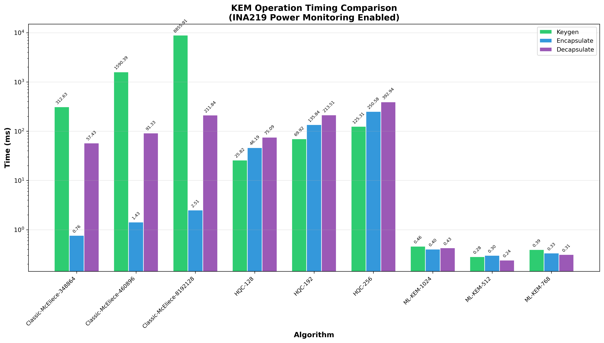
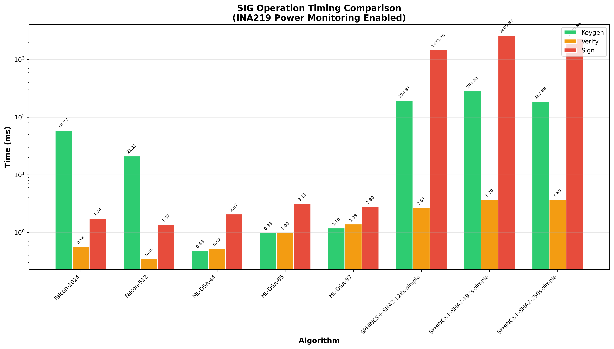
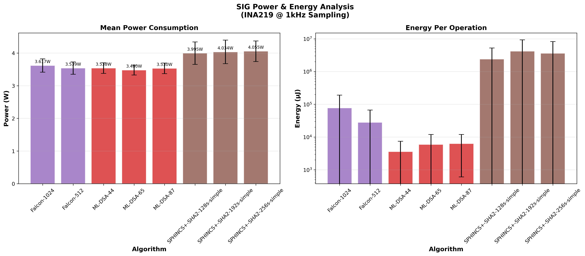
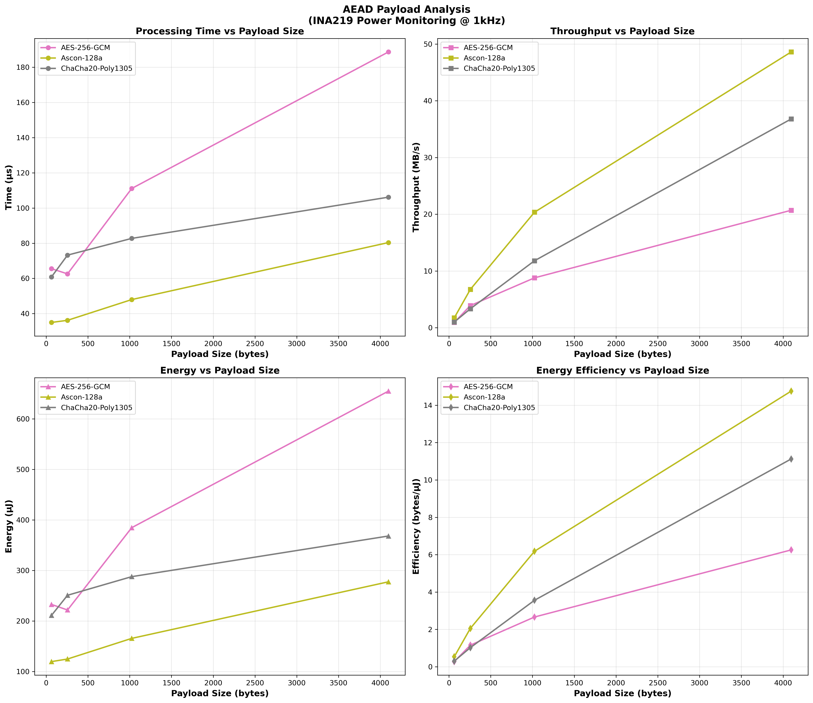
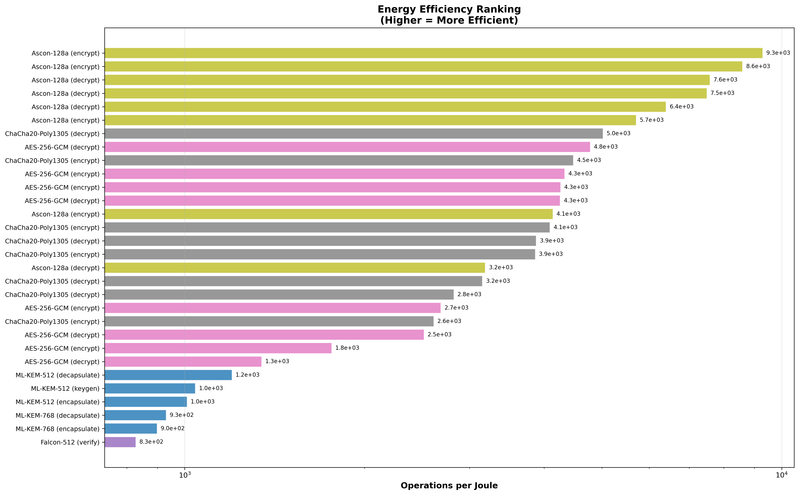
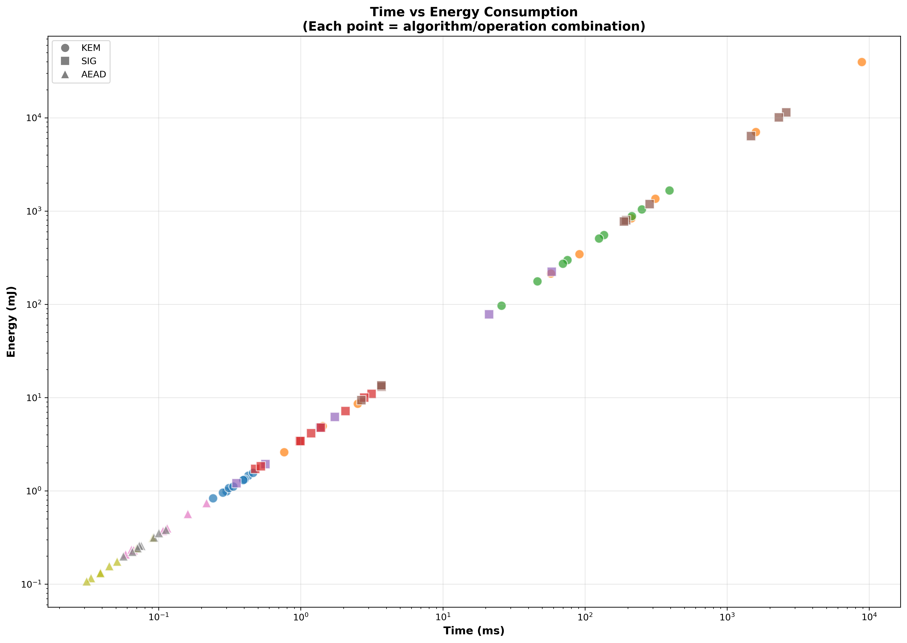
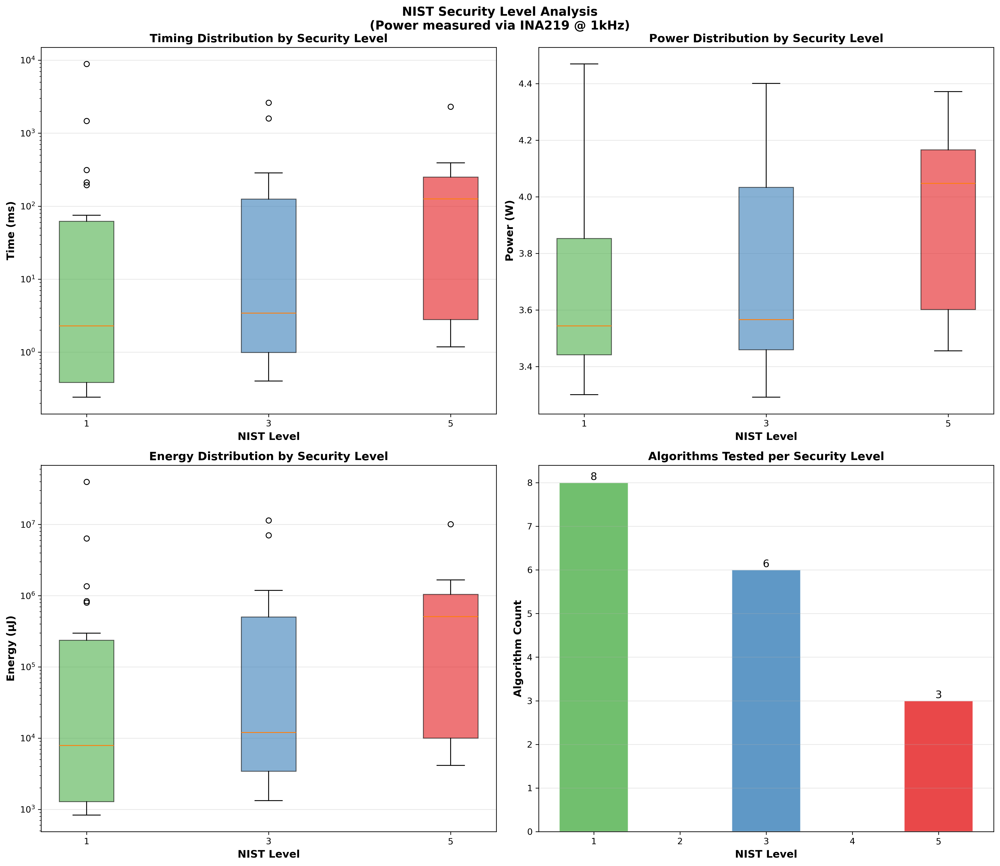
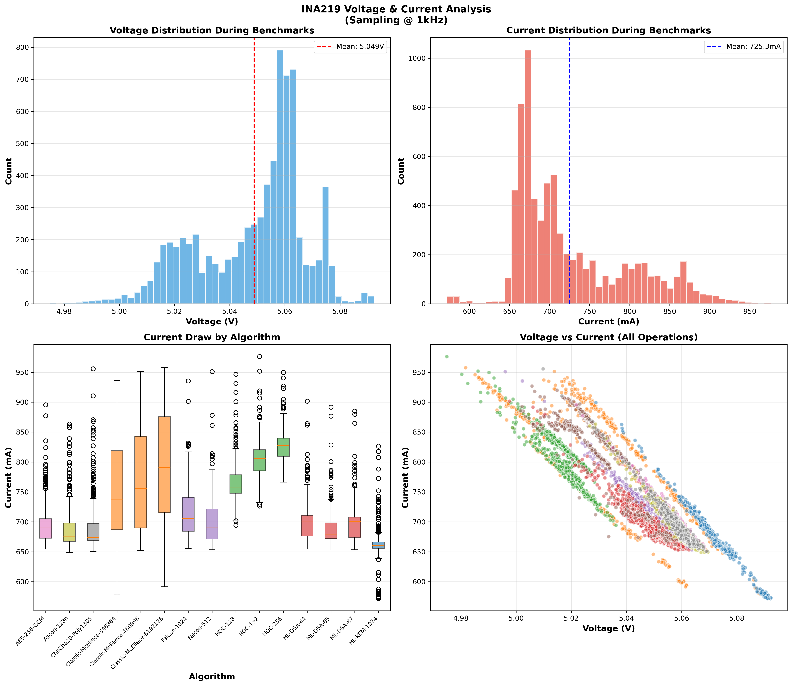
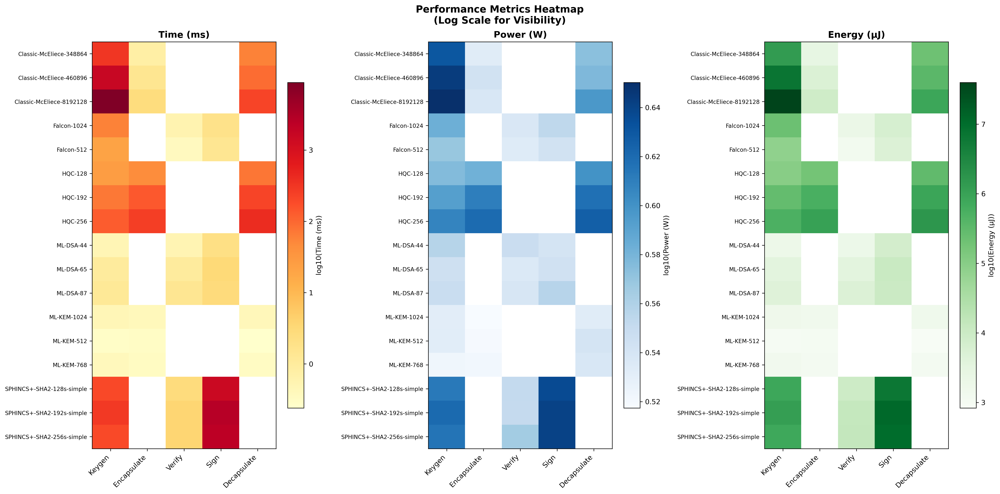

# PQC Benchmark Report with Power & Energy Analysis

**Generated:** 2026-01-17T02:16:36.959810
**Platform:** uavpi
**CPU:** unknown
**Power Monitoring:** INA219 @ 1000 Hz

## Executive Summary

This report presents comprehensive benchmarking results for Post-Quantum Cryptographic (PQC) 
algorithms running on a Raspberry Pi 4 platform. The benchmarks capture both performance 
timing and real-time power consumption using an INA219 current sensor sampling at 1 kHz.

**Total Measurements:** 7,500
**Algorithms Tested:** 20
**Operation Types:** 57

## Test Environment

| Parameter | Value |
|-----------|-------|
| Hostname | uavpi |
| CPU | unknown |
| Cores | 4 |
| CPU Governor | ondemand |
| Memory | 3796 MB |
| Kernel | 6.12.47+rpt-rpi-v8 |
| Python | 3.11.2 |
| liboqs | unknown |
| INA219 Detected | Yes |
| Power Sample Rate | 1000 Hz |

## Key Encapsulation Mechanisms (KEM)

### Performance Overview

Key Encapsulation Mechanisms are fundamental to establishing secure communication channels 
in post-quantum cryptography. They allow two parties to agree on a shared secret that can 
be used for symmetric encryption. The table below shows the performance characteristics of 
each KEM algorithm tested.

**Figure Analysis:** The KEM timing comparison chart displays the execution time for three 
core operations: key generation (keygen), encapsulation, and decapsulation. ML-KEM variants 
demonstrate consistent sub-millisecond performance across all security levels, making them 
suitable for latency-sensitive applications. Classic McEliece shows significantly longer 
keygen times due to its large matrix operations, but excels in encapsulation speed. HQC 
provides a balanced middle ground with moderate timing across all operations.

**Figure Analysis:** The power consumption analysis reveals important insights for 
energy-constrained deployments. Mean power consumption during cryptographic operations 
hovers around 3.3-3.7W, representing the computational overhead above the Pi 4's idle 
power draw. The energy-per-operation metric (right panel) is crucial for battery-powered 
devices - ML-KEM operations require microjoules of energy while McEliece keygen can 
consume hundreds of millijoules due to extended execution time.

### KEM Performance Table

| Algorithm | Operation | Time (ms) | Power (W) | Energy (µJ) |
|-----------|-----------|-----------|-----------|-------------|
| Classic-McEliece-348864 | decapsulate | 57.429 | 3.743 | 214762.18 |
| Classic-McEliece-348864 | encapsulate | 0.765 | 3.408 | 2595.79 |
| Classic-McEliece-348864 | keygen | 312.631 | 4.267 | 1356753.14 |
| Classic-McEliece-460896 | decapsulate | 91.328 | 3.778 | 344908.33 |
| Classic-McEliece-460896 | encapsulate | 1.425 | 3.493 | 4945.78 |
| Classic-McEliece-460896 | keygen | 1590.390 | 4.401 | 7042612.41 |
| Classic-McEliece-8192128 | decapsulate | 211.839 | 3.949 | 836854.67 |
| Classic-McEliece-8192128 | encapsulate | 2.511 | 3.452 | 8594.83 |
| Classic-McEliece-8192128 | keygen | 8855.915 | 4.469 | 39653198.15 |
| HQC-128 | decapsulate | 75.095 | 3.978 | 298564.98 |
| HQC-128 | encapsulate | 46.186 | 3.820 | 176213.91 |
| HQC-128 | keygen | 25.818 | 3.766 | 96869.12 |
| HQC-192 | decapsulate | 213.508 | 4.145 | 884943.37 |
| HQC-192 | encapsulate | 135.842 | 4.073 | 553451.38 |
| HQC-192 | keygen | 69.923 | 3.913 | 273310.53 |
| HQC-256 | decapsulate | 392.944 | 4.227 | 1661049.37 |
| HQC-256 | encapsulate | 250.582 | 4.166 | 1043939.20 |
| HQC-256 | keygen | 125.312 | 4.047 | 507133.41 |
| ML-KEM-1024 | decapsulate | 0.427 | 3.410 | 1457.98 |
| ML-KEM-1024 | encapsulate | 0.403 | 3.292 | 1326.90 |
| ML-KEM-1024 | keygen | 0.461 | 3.398 | 1563.45 |
| ML-KEM-512 | decapsulate | 0.241 | 3.470 | 833.14 |
| ML-KEM-512 | encapsulate | 0.300 | 3.300 | 990.72 |
| ML-KEM-512 | keygen | 0.283 | 3.403 | 959.49 |
| ML-KEM-768 | decapsulate | 0.312 | 3.449 | 1073.90 |
| ML-KEM-768 | encapsulate | 0.335 | 3.322 | 1112.34 |
| ML-KEM-768 | keygen | 0.393 | 3.329 | 1308.41 |

## Digital Signature Algorithms

### Performance Overview

Digital signatures provide authentication, integrity, and non-repudiation in secure 
communications. Post-quantum signature schemes must balance security against both 
classical and quantum attacks while maintaining practical performance.

**Figure Analysis:** The signature timing chart reveals dramatic differences between 
algorithm families. ML-DSA (formerly Dilithium) provides consistent, fast operations 
suitable for high-throughput applications. Falcon offers the fastest verification 
times but requires more complex signing procedures. SPHINCS+ demonstrates the classic 
hash-based signature trade-off: extremely long signing times (seconds) in exchange for 
conservative security assumptions based solely on hash function security.

**Figure Analysis:** Power consumption for signature operations shows interesting patterns. 
While instantaneous power draw remains relatively consistent (3.3-3.7W), the energy cost 
varies dramatically. SPHINCS+ signing operations consume significant energy due to their 
extended duration - a critical consideration for IoT and embedded applications where 
every millijoule counts toward battery lifetime.

### Signature Performance Table

| Algorithm | Operation | Time (ms) | Power (W) | Energy (µJ) |
|-----------|-----------|-----------|-----------|-------------|
| Falcon-1024 | keygen | 58.270 | 3.827 | 223394.77 |
| Falcon-1024 | sign | 1.738 | 3.576 | 6204.52 |
| Falcon-1024 | verify | 0.563 | 3.448 | 1940.92 |
| Falcon-512 | keygen | 21.128 | 3.706 | 78139.82 |
| Falcon-512 | sign | 1.365 | 3.494 | 4736.59 |
| Falcon-512 | verify | 0.353 | 3.418 | 1207.56 |
| ML-DSA-44 | keygen | 0.478 | 3.608 | 1719.64 |
| ML-DSA-44 | sign | 2.067 | 3.476 | 7171.16 |
| ML-DSA-44 | verify | 0.525 | 3.528 | 1838.26 |
| ML-DSA-65 | keygen | 0.982 | 3.508 | 3419.92 |
| ML-DSA-65 | sign | 3.146 | 3.497 | 10931.87 |
| ML-DSA-65 | verify | 0.996 | 3.434 | 3421.52 |
| ML-DSA-87 | keygen | 1.184 | 3.535 | 4155.04 |
| ML-DSA-87 | sign | 2.798 | 3.601 | 10013.32 |
| ML-DSA-87 | verify | 1.386 | 3.455 | 4765.64 |
| SPHINCS+-SHA2-128s-simple | keygen | 194.872 | 4.097 | 798281.03 |
| SPHINCS+-SHA2-128s-simple | sign | 1471.751 | 4.330 | 6372026.98 |
| SPHINCS+-SHA2-128s-simple | verify | 2.670 | 3.559 | 9400.38 |
| SPHINCS+-SHA2-192s-simple | keygen | 284.828 | 4.174 | 1188927.34 |
| SPHINCS+-SHA2-192s-simple | sign | 2609.818 | 4.373 | 11412522.21 |
| SPHINCS+-SHA2-192s-simple | verify | 3.701 | 3.555 | 13063.06 |
| SPHINCS+-SHA2-256s-simple | keygen | 187.883 | 4.121 | 774409.79 |
| SPHINCS+-SHA2-256s-simple | sign | 2309.655 | 4.372 | 10098319.02 |
| SPHINCS+-SHA2-256s-simple | verify | 3.688 | 3.672 | 13506.20 |

## Authenticated Encryption (AEAD)

### Performance Overview

AEAD (Authenticated Encryption with Associated Data) algorithms provide confidentiality 
and integrity in a single operation. These symmetric-key algorithms form the data 
protection layer after key exchange is complete.

**Figure Analysis:** The AEAD payload analysis reveals how encryption performance scales 
with data size. AES-256-GCM benefits from hardware acceleration (AES-NI instructions on 
the Cortex-A72), achieving high throughput for large payloads. ChaCha20-Poly1305 provides 
consistent software performance without hardware dependencies. Ascon-128a, while designed 
for constrained environments, shows competitive performance for small payloads typical 
of IoT telemetry data (64-256 bytes).

## Cross-Algorithm Analysis

### Energy Efficiency Ranking

**Figure Analysis:** This efficiency ranking (operations per joule) provides critical 
guidance for energy-constrained deployments. Higher values indicate more efficient 
algorithms. Fast, low-energy operations like ML-KEM encapsulation and AEAD encryption 
dominate the top rankings, while computationally intensive operations like McEliece 
key generation and SPHINCS+ signing appear at the bottom. For battery-powered devices, 
selecting algorithms from the top of this ranking can significantly extend operational life.

### Time vs Energy Trade-offs

**Figure Analysis:** The scatter plot visualizes the fundamental relationship between 
execution time and energy consumption. Points closer to the origin represent the most 
efficient operations (fast and low-energy). The diagonal trend confirms that energy 
consumption scales roughly linearly with time for most algorithms, given the relatively 
stable power draw of the Pi 4 platform. Outliers above the trend line indicate algorithms 
with higher computational intensity (more CPU cycles per unit time).

### NIST Security Level Analysis

**Figure Analysis:** NIST security levels (1, 3, 5) correspond to increasing resistance 
against cryptanalytic attacks, with Level 1 equivalent to AES-128, Level 3 to AES-192, 
and Level 5 to AES-256. Higher security levels generally require larger parameters, 
leading to increased computational cost. The distribution plots show this expected 
trend: Level 5 algorithms exhibit wider timing and energy distributions due to their 
larger key sizes and more complex operations.

### Electrical Characteristics

**Figure Analysis:** The INA219 sensor data reveals the electrical characteristics of 
the Pi 4 under cryptographic workloads. Voltage remains remarkably stable (5.06-5.08V), 
indicating adequate power supply capacity. Current draw varies between 650-750mA during 
active computation, with brief spikes during intensive operations. The voltage-current 
scatter plot shows the operating envelope, useful for sizing power supplies and battery 
systems for field deployments.

### Performance Heatmap

**Figure Analysis:** The heatmap provides a bird's-eye view of all metrics across all 
algorithm-operation combinations. Darker colors indicate higher values (log scale for 
visibility). This visualization quickly identifies performance outliers: Classic McEliece 
keygen stands out in timing, while SPHINCS+ signing dominates energy consumption. 
Use this heatmap to identify algorithms requiring special consideration in your deployment.

## Recommendations

Based on the benchmark results, we provide the following recommendations:

### For Latency-Critical Applications
- **KEM:** ML-KEM-512 or ML-KEM-768 provide sub-millisecond operations
- **Signature:** ML-DSA-44 or Falcon-512 for fast sign/verify cycles
- **AEAD:** AES-256-GCM with hardware acceleration

### For Energy-Constrained Deployments
- **KEM:** ML-KEM variants minimize energy per key exchange
- **Signature:** Avoid SPHINCS+ for frequent signing; prefer ML-DSA or Falcon
- **AEAD:** Ascon-128a for small payloads, ChaCha20 for larger data

### For Maximum Security
- **KEM:** Classic-McEliece-8192128 (Level 5, code-based security)
- **Signature:** SPHINCS+-SHA2-256s (Level 5, hash-based conservative)
- **AEAD:** AES-256-GCM (256-bit symmetric security)

## Methodology

### Measurement Approach
- Each operation measured with `time.perf_counter_ns()` for nanosecond precision
- Power sampled at 1 kHz using INA219 current sensor on I2C bus
- 50ms warmup and cooldown periods around each operation
- All measurements stored in raw JSON format for reproducibility

### Power Monitoring Setup
- **Sensor:** INA219 bidirectional current/power monitor
- **Address:** 0x40 on I2C bus 1
- **Shunt Resistor:** 0.1Ω
- **Sample Rate:** 1000 Hz (verified 99.54% timing accuracy)
- **Integration:** Using `smbus2` library via `core/power_monitor.py`

---

*Report generated by analyze_power_benchmark.py on 2026-01-17 02:16:36*