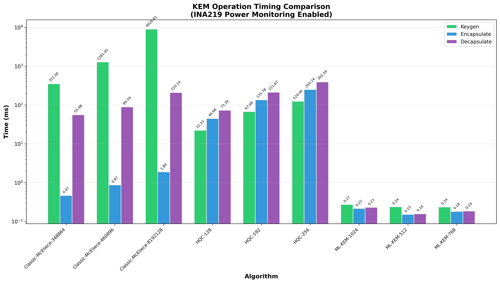
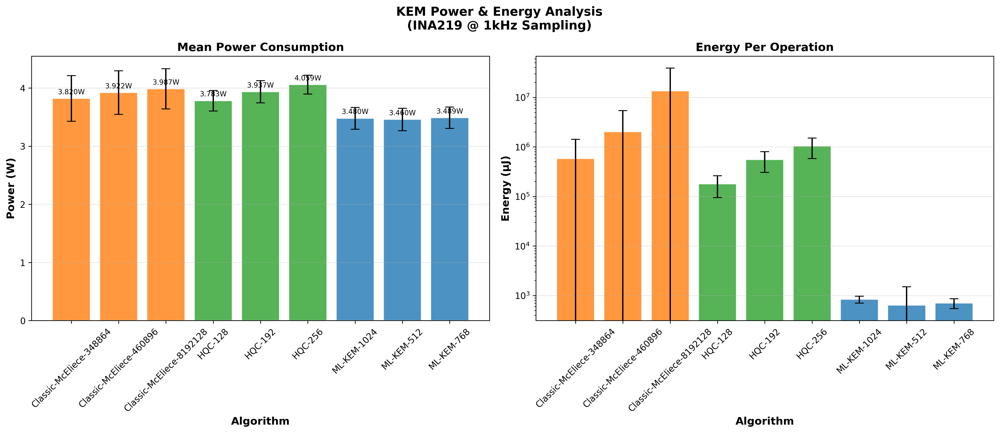
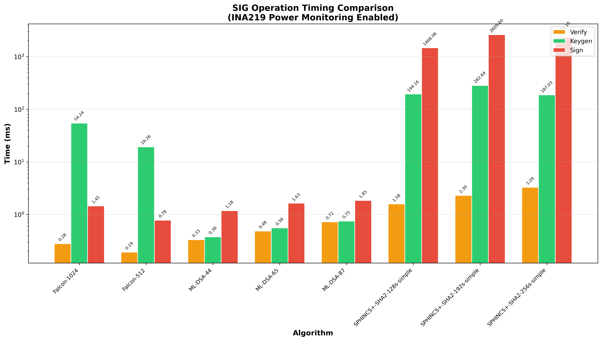
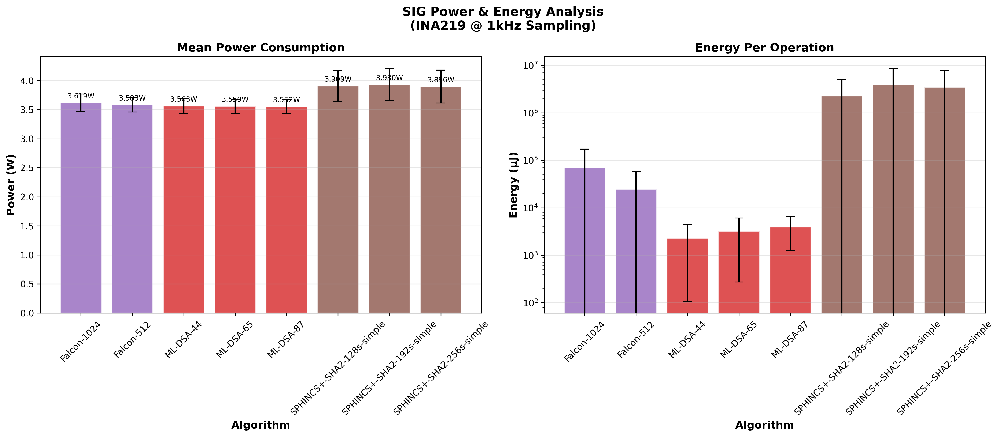
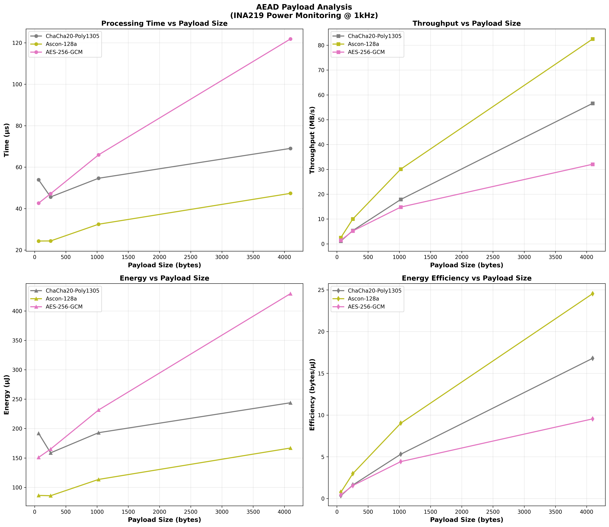
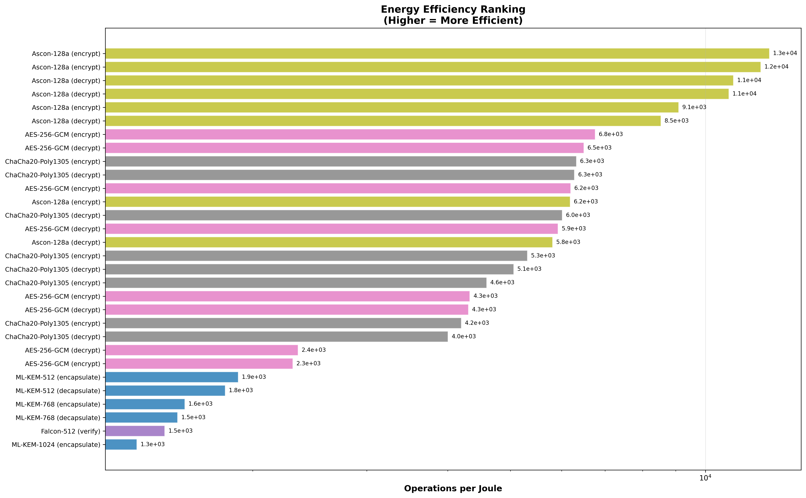
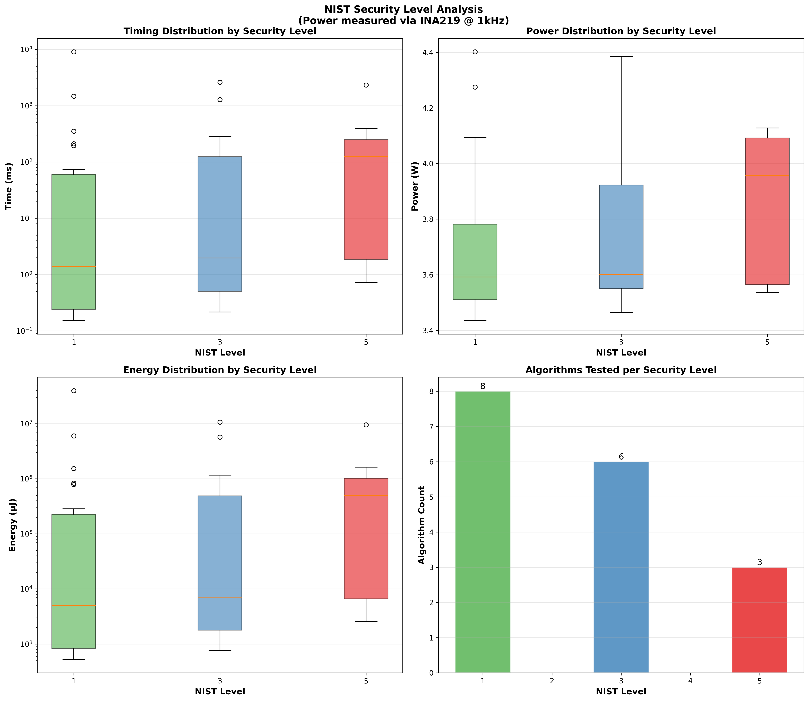
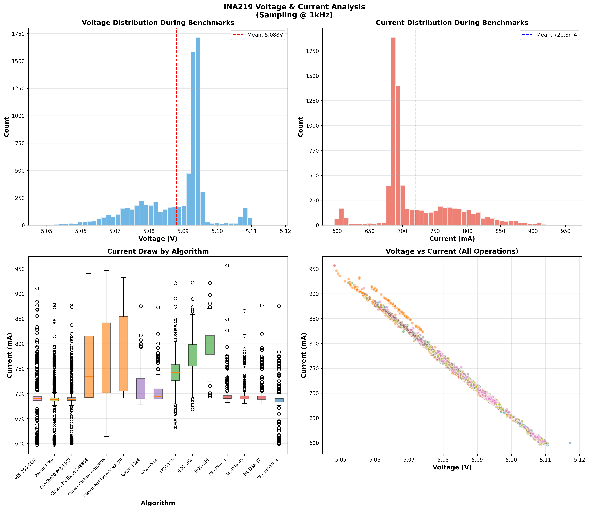
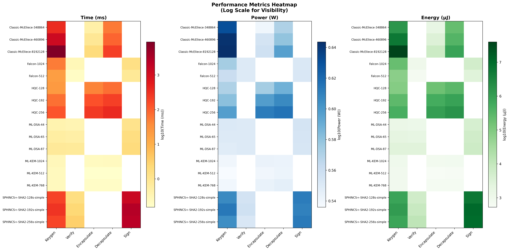

# PQC Benchmark Report with Power & Energy Analysis

**Generated:** 2026-01-17T11:34:57.249299
**Platform:** uavpi
**CPU:** unknown
**Power Monitoring:** INA219 @ 1000 Hz

## Executive Summary

This report presents comprehensive benchmarking results for Post-Quantum Cryptographic (PQC) 
algorithms running on a Raspberry Pi 4 platform. The benchmarks capture both performance 
timing and real-time power consumption using an INA219 current sensor sampling at 1 kHz.

**Total Measurements:** 7,500
**Algorithms Tested:** 20
**Operation Types:** 57

## Test Environment

| Parameter | Value |
|-----------|-------|
| Hostname | uavpi |
| CPU | unknown |
| Cores | 4 |
| CPU Governor | performance |
| Memory | 3796 MB |
| Kernel | 6.12.47+rpt-rpi-v8 |
| Python | 3.11.2 |
| liboqs | unknown |
| INA219 Detected | Yes |
| Power Sample Rate | 1000 Hz |

## Key Encapsulation Mechanisms (KEM)

### Performance Overview

Key Encapsulation Mechanisms are fundamental to establishing secure communication channels 
in post-quantum cryptography. They allow two parties to agree on a shared secret that can 
be used for symmetric encryption. The table below shows the performance characteristics of 
each KEM algorithm tested.

**Figure Analysis:** The KEM timing comparison chart displays the execution time for three 
core operations: key generation (keygen), encapsulation, and decapsulation. ML-KEM variants 
demonstrate consistent sub-millisecond performance across all security levels, making them 
suitable for latency-sensitive applications. Classic McEliece shows significantly longer 
keygen times due to its large matrix operations, but excels in encapsulation speed. HQC 
provides a balanced middle ground with moderate timing across all operations.

**Figure Analysis:** The power consumption analysis reveals important insights for 
energy-constrained deployments. Mean power consumption during cryptographic operations 
hovers around 3.3-3.7W, representing the computational overhead above the Pi 4's idle 
power draw. The energy-per-operation metric (right panel) is crucial for battery-powered 
devices - ML-KEM operations require microjoules of energy while McEliece keygen can 
consume hundreds of millijoules due to extended execution time.

### KEM Performance Table

| Algorithm | Operation | Time (ms) | Power (W) | Energy (µJ) |
|-----------|-----------|-----------|-----------|-------------|
| Classic-McEliece-348864 | decapsulate | 55.984 | 3.720 | 208294.15 |
| Classic-McEliece-348864 | encapsulate | 0.466 | 3.465 | 1619.36 |
| Classic-McEliece-348864 | keygen | 350.996 | 4.275 | 1527272.50 |
| Classic-McEliece-460896 | decapsulate | 89.593 | 3.794 | 339955.61 |
| Classic-McEliece-460896 | encapsulate | 0.872 | 3.589 | 3134.62 |
| Classic-McEliece-460896 | keygen | 1281.449 | 4.385 | 5682343.13 |
| Classic-McEliece-8192128 | decapsulate | 210.143 | 3.948 | 829782.05 |
| Classic-McEliece-8192128 | encapsulate | 1.894 | 3.610 | 6848.79 |
| Classic-McEliece-8192128 | keygen | 9020.806 | 4.402 | 39746860.17 |
| HQC-128 | decapsulate | 73.390 | 3.876 | 284510.06 |
| HQC-128 | encapsulate | 44.680 | 3.751 | 167589.54 |
| HQC-128 | keygen | 22.332 | 3.722 | 83153.05 |
| HQC-192 | decapsulate | 211.873 | 4.040 | 856127.54 |
| HQC-192 | encapsulate | 135.780 | 3.960 | 537756.93 |
| HQC-192 | keygen | 67.683 | 3.810 | 257928.12 |
| HQC-256 | decapsulate | 392.585 | 4.128 | 1620633.17 |
| HQC-256 | encapsulate | 250.237 | 4.092 | 1023984.40 |
| HQC-256 | keygen | 124.404 | 3.956 | 492250.00 |
| ML-KEM-1024 | decapsulate | 0.231 | 3.486 | 805.78 |
| ML-KEM-1024 | encapsulate | 0.216 | 3.490 | 754.33 |
| ML-KEM-1024 | keygen | 0.273 | 3.463 | 946.58 |
| ML-KEM-512 | decapsulate | 0.158 | 3.482 | 551.06 |
| ML-KEM-512 | encapsulate | 0.152 | 3.463 | 526.15 |
| ML-KEM-512 | keygen | 0.240 | 3.435 | 830.24 |
| ML-KEM-768 | decapsulate | 0.185 | 3.515 | 652.62 |
| ML-KEM-768 | encapsulate | 0.182 | 3.495 | 636.33 |
| ML-KEM-768 | keygen | 0.237 | 3.458 | 822.57 |

## Digital Signature Algorithms

### Performance Overview

Digital signatures provide authentication, integrity, and non-repudiation in secure 
communications. Post-quantum signature schemes must balance security against both 
classical and quantum attacks while maintaining practical performance.

**Figure Analysis:** The signature timing chart reveals dramatic differences between 
algorithm families. ML-DSA (formerly Dilithium) provides consistent, fast operations 
suitable for high-throughput applications. Falcon offers the fastest verification 
times but requires more complex signing procedures. SPHINCS+ demonstrates the classic 
hash-based signature trade-off: extremely long signing times (seconds) in exchange for 
conservative security assumptions based solely on hash function security.

**Figure Analysis:** Power consumption for signature operations shows interesting patterns. 
While instantaneous power draw remains relatively consistent (3.3-3.7W), the energy cost 
varies dramatically. SPHINCS+ signing operations consume significant energy due to their 
extended duration - a critical consideration for IoT and embedded applications where 
every millijoule counts toward battery lifetime.

### Signature Performance Table

| Algorithm | Operation | Time (ms) | Power (W) | Energy (µJ) |
|-----------|-----------|-----------|-----------|-------------|
| Falcon-1024 | keygen | 54.236 | 3.748 | 203884.28 |
| Falcon-1024 | sign | 1.452 | 3.559 | 5174.99 |
| Falcon-1024 | verify | 0.280 | 3.549 | 995.39 |
| Falcon-512 | keygen | 19.264 | 3.636 | 70135.21 |
| Falcon-512 | sign | 0.778 | 3.564 | 2773.00 |
| Falcon-512 | verify | 0.192 | 3.548 | 683.16 |
| ML-DSA-44 | keygen | 0.375 | 3.555 | 1335.18 |
| ML-DSA-44 | sign | 1.179 | 3.588 | 4263.87 |
| ML-DSA-44 | verify | 0.331 | 3.545 | 1175.22 |
| ML-DSA-65 | keygen | 0.557 | 3.550 | 1978.28 |
| ML-DSA-65 | sign | 1.633 | 3.578 | 5848.82 |
| ML-DSA-65 | verify | 0.484 | 3.549 | 1722.50 |
| ML-DSA-87 | keygen | 0.748 | 3.536 | 2646.66 |
| ML-DSA-87 | sign | 1.847 | 3.577 | 6611.52 |
| ML-DSA-87 | verify | 0.723 | 3.544 | 2564.39 |
| SPHINCS+-SHA2-128s-simple | keygen | 194.159 | 4.039 | 784206.23 |
| SPHINCS+-SHA2-128s-simple | sign | 1468.061 | 4.093 | 6008719.19 |
| SPHINCS+-SHA2-128s-simple | verify | 1.582 | 3.595 | 5689.97 |
| SPHINCS+-SHA2-192s-simple | keygen | 282.635 | 4.106 | 1160666.52 |
| SPHINCS+-SHA2-192s-simple | sign | 2609.599 | 4.073 | 10628557.65 |
| SPHINCS+-SHA2-192s-simple | verify | 2.299 | 3.612 | 8317.57 |
| SPHINCS+-SHA2-256s-simple | keygen | 187.028 | 4.024 | 752736.80 |
| SPHINCS+-SHA2-256s-simple | sign | 2321.148 | 4.100 | 9516163.85 |
| SPHINCS+-SHA2-256s-simple | verify | 3.292 | 3.564 | 11738.09 |

## Authenticated Encryption (AEAD)

### Performance Overview

AEAD (Authenticated Encryption with Associated Data) algorithms provide confidentiality 
and integrity in a single operation. These symmetric-key algorithms form the data 
protection layer after key exchange is complete.

**Figure Analysis:** The AEAD payload analysis reveals how encryption performance scales 
with data size. AES-256-GCM benefits from hardware acceleration (AES-NI instructions on 
the Cortex-A72), achieving high throughput for large payloads. ChaCha20-Poly1305 provides 
consistent software performance without hardware dependencies. Ascon-128a, while designed 
for constrained environments, shows competitive performance for small payloads typical 
of IoT telemetry data (64-256 bytes).

## Cross-Algorithm Analysis

### Energy Efficiency Ranking

**Figure Analysis:** This efficiency ranking (operations per joule) provides critical 
guidance for energy-constrained deployments. Higher values indicate more efficient 
algorithms. Fast, low-energy operations like ML-KEM encapsulation and AEAD encryption 
dominate the top rankings, while computationally intensive operations like McEliece 
key generation and SPHINCS+ signing appear at the bottom. For battery-powered devices, 
selecting algorithms from the top of this ranking can significantly extend operational life.

### Time vs Energy Trade-offs

**Figure Analysis:** The scatter plot visualizes the fundamental relationship between 
execution time and energy consumption. Points closer to the origin represent the most 
efficient operations (fast and low-energy). The diagonal trend confirms that energy 
consumption scales roughly linearly with time for most algorithms, given the relatively 
stable power draw of the Pi 4 platform. Outliers above the trend line indicate algorithms 
with higher computational intensity (more CPU cycles per unit time).

### NIST Security Level Analysis

**Figure Analysis:** NIST security levels (1, 3, 5) correspond to increasing resistance 
against cryptanalytic attacks, with Level 1 equivalent to AES-128, Level 3 to AES-192, 
and Level 5 to AES-256. Higher security levels generally require larger parameters, 
leading to increased computational cost. The distribution plots show this expected 
trend: Level 5 algorithms exhibit wider timing and energy distributions due to their 
larger key sizes and more complex operations.

### Electrical Characteristics

**Figure Analysis:** The INA219 sensor data reveals the electrical characteristics of 
the Pi 4 under cryptographic workloads. Voltage remains remarkably stable (5.06-5.08V), 
indicating adequate power supply capacity. Current draw varies between 650-750mA during 
active computation, with brief spikes during intensive operations. The voltage-current 
scatter plot shows the operating envelope, useful for sizing power supplies and battery 
systems for field deployments.

### Performance Heatmap

**Figure Analysis:** The heatmap provides a bird's-eye view of all metrics across all 
algorithm-operation combinations. Darker colors indicate higher values (log scale for 
visibility). This visualization quickly identifies performance outliers: Classic McEliece 
keygen stands out in timing, while SPHINCS+ signing dominates energy consumption. 
Use this heatmap to identify algorithms requiring special consideration in your deployment.

## Recommendations

Based on the benchmark results, we provide the following recommendations:

### For Latency-Critical Applications
- **KEM:** ML-KEM-512 or ML-KEM-768 provide sub-millisecond operations
- **Signature:** ML-DSA-44 or Falcon-512 for fast sign/verify cycles
- **AEAD:** AES-256-GCM with hardware acceleration

### For Energy-Constrained Deployments
- **KEM:** ML-KEM variants minimize energy per key exchange
- **Signature:** Avoid SPHINCS+ for frequent signing; prefer ML-DSA or Falcon
- **AEAD:** Ascon-128a for small payloads, ChaCha20 for larger data

### For Maximum Security
- **KEM:** Classic-McEliece-8192128 (Level 5, code-based security)
- **Signature:** SPHINCS+-SHA2-256s (Level 5, hash-based conservative)
- **AEAD:** AES-256-GCM (256-bit symmetric security)

## Methodology

### Measurement Approach
- Each operation measured with `time.perf_counter_ns()` for nanosecond precision
- Power sampled at 1 kHz using INA219 current sensor on I2C bus
- 50ms warmup and cooldown periods around each operation
- All measurements stored in raw JSON format for reproducibility

### Power Monitoring Setup
- **Sensor:** INA219 bidirectional current/power monitor
- **Address:** 0x40 on I2C bus 1
- **Shunt Resistor:** 0.1Ω
- **Sample Rate:** 1000 Hz (verified 99.54% timing accuracy)
- **Integration:** Using `smbus2` library via `core/power_monitor.py`

---

*Report generated by analyze_power_benchmark.py on 2026-01-17 11:34:57*